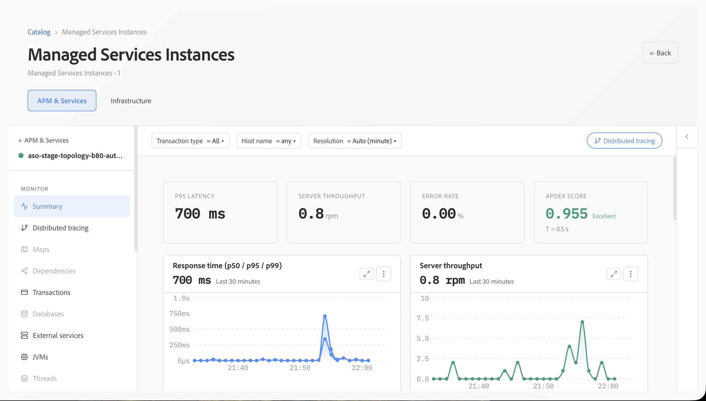
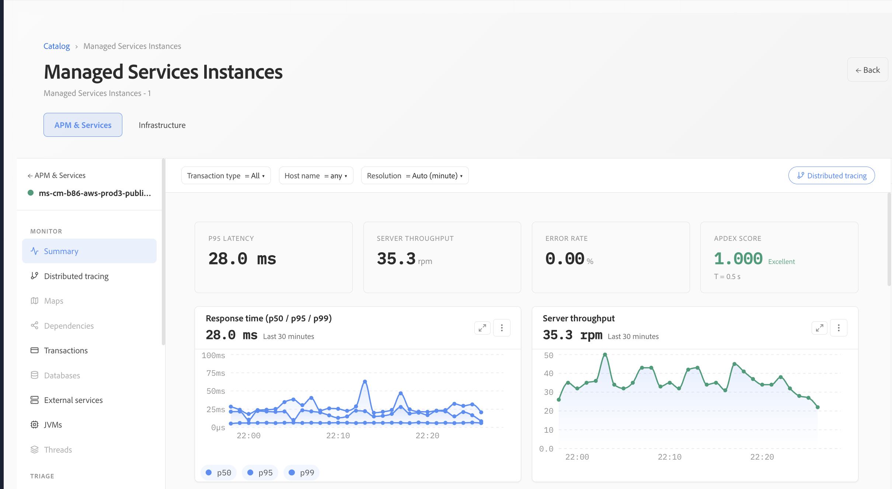
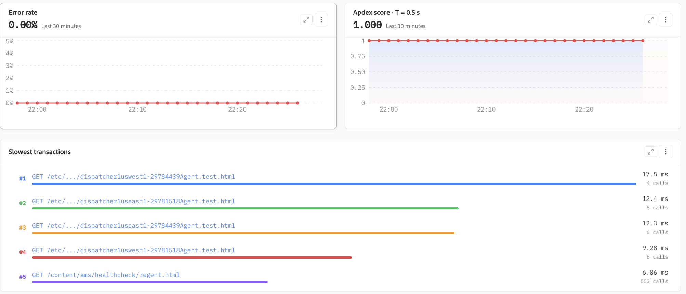
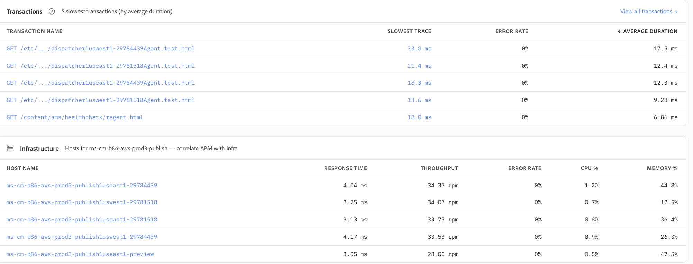
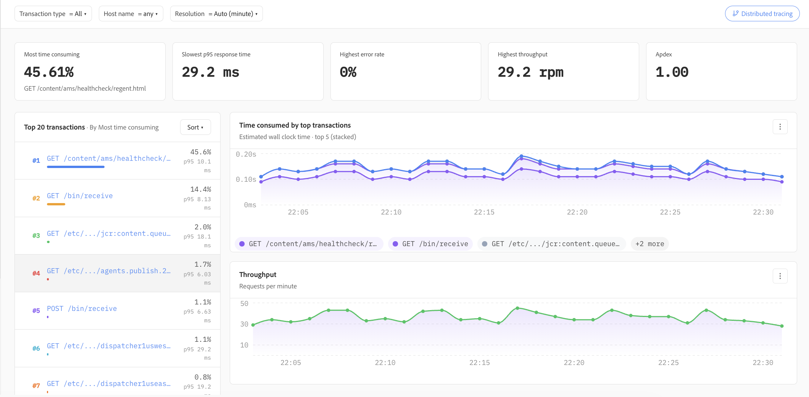

# 应用程序

应用程序提供应用程序性能监控(APM)功能，提供应用程序运行状况、性能、事务和支持每个服务的底层基础架构的统一视图。 它有助于运营和工程团队了解应用程序行为，发现性能瓶颈，并从高级别的运行状况指标转移到个别事务以进行更深入的研究。

## 应用程序摘要

**应用程序**&#x200B;摘要提供了所选应用程序的概览。 关键指标（如p95延迟、服务器吞吐量、错误率和Apdex）使评估选定时间范围内的应用程序运行状况变得容易。

利用事务类型、主机和解决方案的过滤器，可以针对特定调查对视图进行细化。 响应时间和吞吐量趋势提供了额外的背景信息，可帮助团队区分孤立的峰值和持续的性能变化。

## 响应时间、吞吐量和Apdex

可以使用百分位响应时间以及请求吞吐量来评估应用程序性能。 同时查看p50、p95和p99延迟有助于区分典型用户体验和较慢的异常值。

Apdex通过将响应时间性能转换为易于理解的满意度分数，提供了对应用程序响应能力的补充性衡量。 这些量度与错误率一起提供了应用程序是否在预期性能级别内运行的简要指示。

## 错误和事务速度慢

应用程序不断显示错误率趋势和慢速事务，以帮助识别可能影响应用程序性能的请求。 通过错误率视图，可以轻松识别随时间发生的变化，而Apdex趋势则显示了对应用程序响应能力的相应影响。

**最慢事务**&#x200B;视图突出显示具有最高平均持续时间的事务并包含调用量，从而更容易区分频繁执行的工作负载和孤立的慢速请求。

## 交易和基础设施关联

事务列表提供了最慢事务类型的集中视图，包括它们的最慢观察到的跟踪、错误率和平均持续时间。 这有助于团队快速识别需要进一步调查的交易模式。

应用程序数据与底层主机相关联，以便事务性能可以与诸如响应时间、吞吐量、CPU利用率和内存利用率等基础结构指标一起评估。 此关联有助于确定性能问题是否源于应用程序处理或者是否与支持基础架构相关。

## 事务性能分析

事务分析视图按性能特征对事务进行排名，并总结关键指标，如最耗时的事务、最慢的p95响应时间、最高的错误率、吞吐量和Apdex。

时序可视化图表显示了最重要的事务对整体处理时间的贡献以及请求吞吐量在选定时段内的变化。 这使得识别高影响力的端点、比较事务行为以及确定应首先调查哪些请求变得更加容易。

## 调查性能问题

应用程序支持渐进式调查工作流程：从应用程序级别的运行状况和性能指标开始，识别异常响应时间、错误或吞吐量更改，然后将调查范围缩小到对问题贡献最大的事务。 事务数据可以与主机级基础结构度量相关联。

此工作流可帮助团队高效地从&#x200B;**应用程序运行状况→性能趋势移动→主机**→的事务中，从而减少隔离性能问题的源所需的时间。
