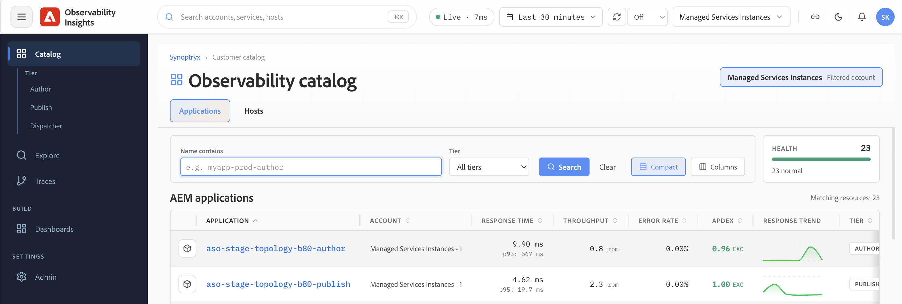

# 可观察性分析入门 {#get-started}

本节介绍面向新用户的要点：如何访问您的Observability Insights帐户，Adobe代表您监控哪些环境和数据，以及如何导航本文档其余部分。

## 可观察性分析界面 {#observability-insights-interface}

登录[insights.adobecqms.net](https://insights.adobecqms.net)时，打开的屏幕为您提供一个进入AEM Managed Services环境的所有监视区域的入口点。

该界面围绕两个核心监控区域组织：

- **应用程序** — 显示创作层和发布层的应用程序性能数据。 使用它可以调查请求吞吐量、错误率、延迟、JVM行为和跟踪级别的执行详细信息。 查看[应用程序](../applications.md)。
- **主机** — 显示托管拓扑中的主机级运行状况数据。 使用此选项可评估各个服务器上的CPU、内存、磁盘、网络和存储信号。 查看[主机](../hosts.md)。

对于客户用户，这两个区域均为只读。 Adobe Managed Services可管理帐户配置、工具和管理控制。

## 访问和帐户管理 {#access-overview}

可观察性分析访问权限通过Adobe IMS进行管理。 Adobe可配置和管理贵组织的帐户；客户团队可获得对所有监控数据的只读访问权限。

要点：

- 您组织的Observability Insights帐户已链接到单个Adobe主帐户。
- Managed Services合同中的所有环境（创作和发布、生产和非生产）都报告到此帐户中。
- 用户访问权限由您的客户成功工程师(CSE)进行配置和管理。

有关设置步骤、用户角色以及客户用户可以做什么、不能做什么，请参阅[访问和帐户管理](access-and-accounts.md)。

## 覆盖范围、环境和数据保留 {#coverage-overview}

Adobe使用Observability Insights APM Java插件监控您的AEM创作层和发布层，并使用Observability Insights Infrastructure代理监控所有托管服务器。 监控功能在非生产环境和生产环境中均已启用。

要点：

- 每个AEM Managed Services环境都包含一个用于创作的APM应用程序和一个用于发布的APM应用程序。
- APM量度、基础结构量度和事件最多可保留&#x200B;**30天**。
- 可观察性分析适合于操作分析和最近的趋势比较；它不是存档或长期报告工具。 在数据过期之前捕获屏幕快照或导出证据。

有关全面覆盖范围的详细信息（包括应用程序在您的帐户中的呈现方式以及保留时间范围对运营的影响），请参阅[覆盖范围、环境和数据保留](coverage-and-data.md)。

## 如何构建本指南 {#how-this-guide-is-structured}

文档分为四个部分。 使用下面的描述直接转到您需要的内容。

**开始使用** — 此分区。 涵盖访问、帐户配置、监控范围和数据保留。

**[使用可观察性洞察](../use-observability-insights.md)** — 面向任务的日常调查指导。 当症状面向应用程序时，请使用[应用程序](../applications.md)：页面速度慢、错误尖峰或不稳定的事务。 当您需要确定主机级资源压力（CPU、内存、磁盘或网络）是否说明了您在应用程序中看到的内容时，请使用[主机](../hosts.md)。 在[调查应用程序问题](../use-cases/investigate-application-issues.md)和[调查基础结构问题](../use-cases/investigate-infrastructure-issues.md)中提供了分步调查流程。

**[常见问题](../troubleshooting/common-questions.md)** — 在活动事件期间不确定从何处开始或需要快速回答的常见问题和面向支持的入口点。
