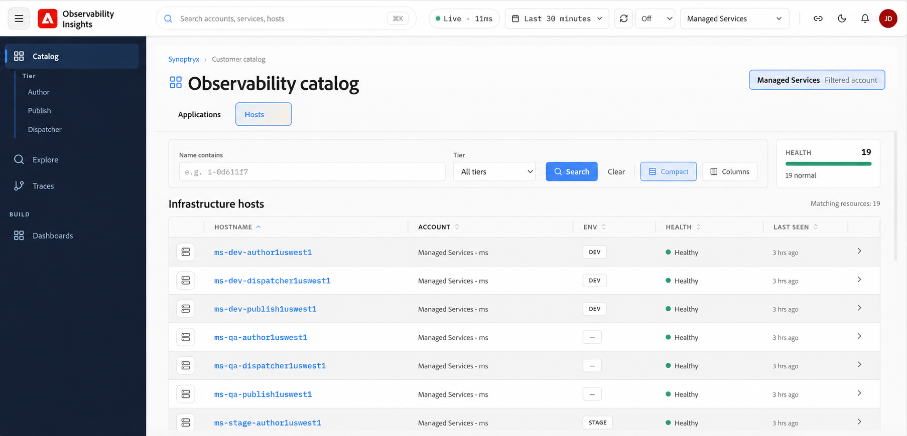
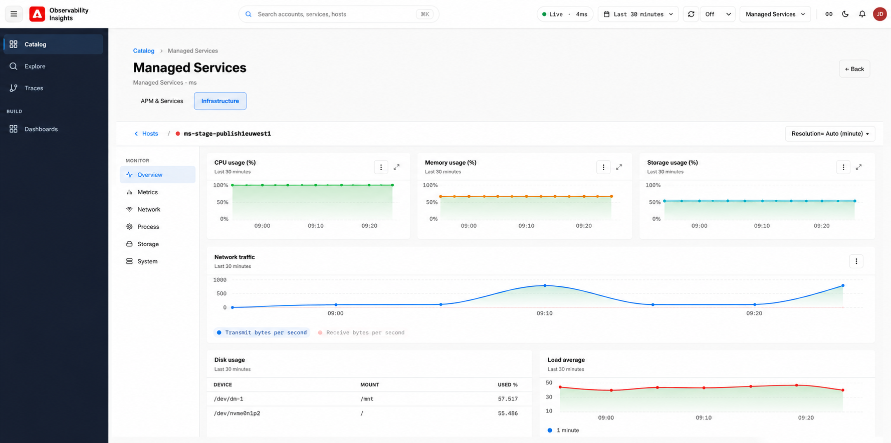

# 主机 {#hosts}

在Observability Insights中使用主机监视支持您的应用程序和服务的基础结构的运行状况、性能和资源利用率。 使用基础架构仪表板识别与主机容量、存储压力、网络吞吐量或操作系统资源争用相关的问题。

## 基础架构监控可以帮助您回答哪些问题 {#what-infrastructure-monitoring-helps-you-answer}

当您需要回答以下问题时，基础架构监控最有用：

- 应用程序速度减慢是否伴有CPU、内存或I/O压力？
- 一台主机的行为是否与同一环境中的其他主机的行为不同？
- 网络或磁盘模式是否在与客户事件相同的间隔内发生变化？
- 存储利用率趋势是否表明即将出现容量问题？

## 访问基础架构主机 {#infrastructure-host-overview}

基础架构监控在主机级别提供了对支持您的托管AEM环境的基础架构的运行状况和性能的可视性。 从&#x200B;**可观察性目录**&#x200B;中，您可以浏览基础结构主机并深入到单个主机，以调查CPU、内存、网络、存储和其他系统级信号。

## 访问基础架构主机

从&#x200B;**目录**&#x200B;中，选择&#x200B;**主机**&#x200B;选项卡以查看与所选帐户关联的基础结构。

**基础结构主机**&#x200B;视图提供了受监视主机的清单，其中包括：

- **主机名** — 受监视的基础结构主机的名称。
- **帐户** — 与主机关联的帐户。
- **环境** — 环境分类，如`DEV`或`STAGE`。
- **运行状况** — 主机的当前运行状况。
- **上次出现时间** — 最近从主机接收遥测的时间。

## 建议调查流程 {#suggested-investigation-flow}

对于大多数事件，请按照以下顺序查看主机仪表板：

1. 检查CPU利用率、平均负载和内存使用率是否明显饱和。
2. 如果响应时间增加而没有匹配的CPU尖峰，请查看CPU I/O等待和磁盘吞吐量。
3. 比较网络吞吐量和应用程序流量，以确定与负载相关的班次。
4. 检查存储使用量和文件系统级别的磁盘使用量，以了解永久性容量风险。
5. 比较多个主机，以查看问题是本地化的还是系统性的。

## 首先查看内容 {#what-to-review-first}

- **CPU和内存**（应用程序在较广的时间范围内显示缓慢或不稳定时）。
- 当请求意外停止或排队时，**磁盘I/O和CPU I/O等待**。
- 当流量特性发生变化或怀疑下游依赖关系时，**网络I/O**。
- 当事件涉及部署失败、索引压力或长期容量问题时，**存储使用情况**。

使用&#x200B;**Name contains**&#x200B;字段和&#x200B;**层**&#x200B;筛选器缩小主机列表范围。 选择主机名以打开其基础架构监视详细信息。

## 主机监控

选择主机后，**基础架构**&#x200B;视图会为该主机提供专用监视页面。

主机导航包括：

- **概述** — 关键基础架构运行状况和利用率信号的整合视图。
- **指标** — 详细的主机性能指标，包括CPU、内存、负载、磁盘I/O和网络吞吐量。
- **网络** — 网络流量、接口活动和传输/接收错误。
- **进程** — 主机进程级监视。
- **存储** — 磁盘利用率、磁盘I/O和文件系统利用率。
- **系统** — 核心系统资源指标，如CPU、内存和平均负载。

## 调查期间要回答的问题 {#questions-to-answer}

- 该问题是否孤立于一台主机，或者是否在整个环境中可见？
- CPU、内存或磁盘信号是否在事件发生的同一时间段内被提升？
- 存储增长是否趋向于可能影响操作的阈值？
- 基础架构症状是解释了应用程序行为还是只表现为下游效应？

## 在升级时要捕获的证据 {#evidence-to-capture}

- 受影响的环境和主机
- 问题的时间范围
- CPU、内存、磁盘和网络屏幕截图
- 异常是孤立的还是系统性的
- APM中的相关应用程序症状
