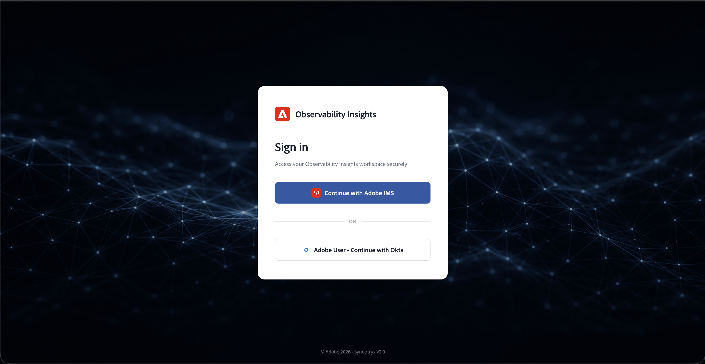

# 使用可观察性分析监控AEM Managed Services环境 {#observability-insights-monitoring}

“可观察性洞察”功能提供了对Adobe Experience Manager Managed Services中应用程序性能、基础架构运行状况和服务行为的可视性，而无需单独的监控平台。

如果您负责服务可靠性、事件响应或性能分析，可观察性分析可帮助您快速从症状变为证据。 它结合了应用程序遥测和主机级别的运行状况信号，因此客户团队和Adobe Managed Services可以从共享的操作视图中调查问题。

## 为什么团队使用可观察性洞察？ {#why-teams-use-observability-insights}

使用Observability Insights回答操作问题，例如：

- 该问题会影响“作者”和/或“发布”吗？
- 问题是由应用程序行为、主机资源压力还是两者的组合造成的？
- 哪些交易、端点或状态组可以解释错误或延迟的激增？
- 问题是否仅存在于一个环境中，或者在整个拓扑中是否可见？

可观察性分析旨在对最近的行为进行操作分析。 它可帮助您识别哪些内容发生了更改、更改了哪些内容以及哪些信号在升级或纠正操作之前最相关。

## 什么可观察性分析可以帮助您做到这一点？ {#what-observability-insights-helps-you-do}

使用可观察性分析可以：

- 了解创作层和发布层在实际流量下的行为。
- 将应用程序延迟、错误率和JVM运行状况与主机级信号关联起来。
- 确认问题是否局限于一个环境、一个层或一台主机。
- 在调查期间为Adobe Managed Services和您的内部团队提供共享的操作视图。

可观察性分析包含在AEM Managed Services中。 Adobe可配置和管理帐户、工具支持的环境，并将生成的功能板作为只读操作工具向您的团队公开。

由于Adobe管理平台设置和工具，因此您可以将重点放在调查和解释上，而不是代理部署、帐户管理或仪表板组装上。

## 概览 {#at-a-glance}

在AEM Managed Services中，您将收到：

- **专用可观察性分析帐户** — 由Adobe Managed Services配置和监督，对您的团队具有只读访问权限。
- **深层AEM事务监控** — Observability Insights APM代理跟踪有意义的事务到方法调用（包括行号）、外部依赖项和存储库操作。
- **统一应用程序和主机视图** — 将应用程序和主机级别的量度相结合，全面优化性能。

## 本文档面向谁 {#who-this-documentation-is-for}

本文档主要用于：

- 需要了解受监控环境的AEM Managed Services管理员
- 处理事件、趋势分析和服务审查的业务和支持团队
- 调查期间与Adobe Managed Services合作的客户工程团队
- 需要了解监控范围和操作责任的利益相关者

## Adobe使用可观察性分析监控什么 {#what-we-monitor}

Adobe使用Observability Insights APM Java插件监视AEM **创作**&#x200B;和&#x200B;**发布**&#x200B;层。 使用Observability Insights Infrastructure代理监视拓扑中的所有托管服务器。 在非生产和生产Managed Services环境中均启用了自定义APM和基础架构监控。

### 您帐户中的应用程序 {#applications-in-your-account}

您的Observability Insights帐户已链接到单个Adobe主帐户，并可接收来自多个应用程序的数据，包括：

- 每个AEM Managed Services环境一个&#x200B;**作者**&#x200B;层的APM应用程序
- 每个AEM Managed Services环境一个&#x200B;**发布**&#x200B;层的APM应用程序

每个应用程序都有自己的许可证密钥。 Managed Services合同中的所有拓扑都报告到一个可观察性分析帐户中。 APM和基础结构量度和事件最多可保留&#x200B;**30天**。

## 访问您的帐户 {#access}

监控数据整合到Adobe配置和管理的可观察性分析帐户中。 客户用户收到对代理收集的APM和基础结构数据的&#x200B;**只读访问权限**。 Adobe Managed Services保留帐户所有权和管理控制权。

### 先决条件 {#access-prerequisites}

在登录之前，请确认以下事项：

- 您的组织有一个有效的&#x200B;**AEM Managed Services**&#x200B;订阅。 可观察性分析包括在内，不收取额外费用。
- 您的客户成功工程师(CSE)已配置您的Adobe IMS帐户，并授予您访问贵组织的可观察性分析帐户的权限。

>[!NOTE]
>
> **要获取访问权限：**&#x200B;要获取对Observability Insights的访问权限，需要配置Adobe IMS。 联系您的客户成功工程师(CSE)以配置和管理组织的用户访问权限。

在CSE设置了帐户后，登录到[insights.adobecqms.net](https://insights.adobecqms.net)。 此URL对于所有AEM Managed Services客户都相同；您组织的环境和功能板将作用域限定于您的配置帐户。
