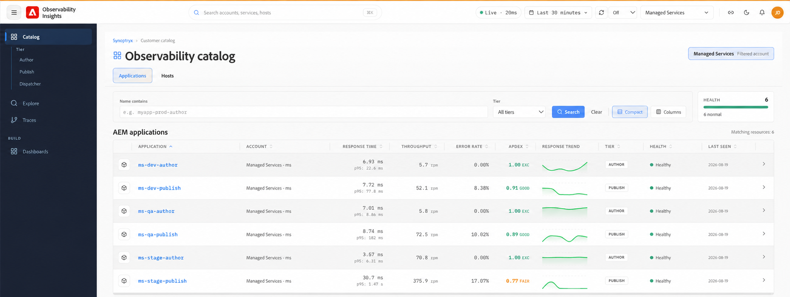

# 使用可观察性洞察 {#use-observability-insights}

本节涵盖您的团队最常使用的日常监控和调查工作流，这些工作流围绕两个监控区域组织：应用程序性能监控和基础架构监控。

## 可观察性分析界面 {#observability-insights-interface}

通过可观察性分析左侧导航面板，可访问AEM Managed Services环境的所有监视区域。

该导航包括：

- **目录** — 集中清点受监视的AEM应用程序和主机。 跨&#x200B;**创作、发布和Dispatcher**&#x200B;层浏览资源，浏览运行状况以及响应时间、吞吐量、错误率和Apdex等关键绩效指标。

- **浏览** — 调查可观察性遥测并跨受监视的资源钻取性能数据。

- **跟踪** — 分析端到端应用程序事务并请求跟踪，以识别延迟、错误和性能瓶颈。

- **仪表板** — 访问策划的仪表板，以更深入地可视化和监控应用程序和基础架构信号。

资源可以按帐户和层进行过滤，而目录可以跨托管的AEM拓扑提供应用程序和主机运行状况的统一视图。

## 应用程序{#applications}

当问题面向应用程序时，使用[应用程序](applications.md) — 页面速度慢、错误率上升、事务不稳定或创作或发布时出现意外延迟。

应用程序可以帮助您回答以下问题：

- 该问题是否孤立于“创作”、“发布”，还是同时影响这两个层？
- 哪些端点或交易对流量和速度减慢的贡献最大？
- 在部署或流量尖峰之前或之后，延迟或错误是否发生变化？
- 跟踪是否指向存储库操作、外部依赖项或JVM压力？

应用程序可以对AEM交易进行详细分析，包括方法调用、外部依赖项和存储库操作，因此您可以快速地从各种症状转变为特定的执行路径。

## 主机 {#hosts}

当需要确定应用程序行为是由主机资源条件（CPU饱和度、内存压力、磁盘I/O、网络吞吐量或存储容量）引起还是加剧时，请使用[主机](hosts.md)。

主机监视可帮助您回答以下问题：

- 在主机级别，应用程序速度减慢是否伴有CPU、内存或I/O压力？
- 一台主机的行为是否与同一环境中的其他主机的行为不同？
- 磁盘或存储利用率趋势是否表明即将出现容量问题？
- 基础架构模式是解释应用程序行为还是对下游的影响？

将主机功能板与应用程序结合使用，以区分应用程序级别的回归和环境级别的资源限制。

两篇文章都包含调查工作流程、指导分类的问题，以及升级到Adobe Managed Services时要捕获的证据列表。
